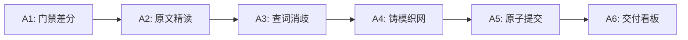

# 第二大脑知识工序

> 规范指针:
> - 六级证据权威度: [`references/evidence_levels.md`](references/evidence_levels.md)
> - 三态认识论模型: [`references/three_mode_epistemology.md`](references/three_mode_epistemology.md)

---

## 意图路由

```python
if user_intent in ["执行摄入流程", "摄取新资料", "处理新文献"]:
    route = "流水线 A：文献摄取"
elif user_intent in ["批量孵化主题", "扫描幽灵雷达", "孵化topics"]:
    route = "流水线 B：主题孵化"
elif user_intent in ["合流词表", "整理受控词", "日志归档", "指标回填"]:
    route = "流水线 C：系统维护与合流"
elif user_intent in ["合成高阶洞察", "跨学科映射", "全景方案推演"]:
    route = "流水线 D：合成洞察"
else:
    raise ValueError("意图未匹配，严禁越界执行")
```

---

## 流水线 A：文献摄取



### Step A1: 门禁差分与路由
```python
diff_res = run_command(CommandLine="python .scripts/gatekeeper.py diff")
if diff_res.status == "IDLE" or not diff_res.diff_queue:
    terminate("当前无新资料待摄取")

for item in diff_res.diff_queue:
    assert "/" not in item.file.removeprefix("raw/")  # 仅限 raw/ 根目录物理文件
    target_wiki = item.target_wiki_hint  # 强制锁定目标卡片路径，严格采用 diff 派发指针，严禁嗅探盘符或重命名
    
    if item.ingestion_track == "STANDARD":
        view_file(AbsolutePath=item.file)  # 常规单篇: 唯一合法读取工具为 view_file，严禁调用 slice_raw.py
    elif item.ingestion_track == "MASSIVE_DUAL_TRACK":
        # 超长分治: 页数 >= 35 或预估消耗 >= 33,600 Tokens (纯扫描字符/页 < 30 熔断)
        run_massive_track(item.file)
```

#### 超长分治执行规程:
1. **全景骨架探测**: `python .scripts/slice_raw.py inspect --file "<file>" --json` 提取目录树(TOC)、前言与符号表。
2. **自然章节语义分治**: 三级自愈（原生书签 > 印刷目录/字号跳变 > 15页+2~3页滑动重叠兜底 100% 覆盖）；运行 `python .scripts/slice_raw.py plan-subagents --file "<file>" --json` 派发契约。
3. **渐进自足三层架构**:
   - Master Hub (`wiki/主书名.md`): 承载规范全貌与页码映射。
   - 下游主题卡片: Layer 0 悬停秒看 $\le 5$ 行（置顶 Callout）；Layer 1 决策矩阵 $\le 60$ 行（正文机制与核心表）；Layer 2 原始流水沉淀留指针（出处网络记录章节页码）。
   - 中间草稿暂存 `.scratch/shadow_drafts/`，由 `python .scripts/gatekeeper.py promote-drafts` 过滤中间切片转正合格卡片，再运行 `python .scripts/slice_raw.py audit --wiki "<wiki>"` 审计。

### Step A2: 原文精读与要素提炼
1. **六级证据与三态模式内联准则**:
   - 证据梯队: `L1_standard` (法定标准/指南), `L2_causal_synthesis` (顶级Meta/RCT), `L3_empirical_peer_reviewed` (顶刊/发明专利), `L4_industry_framework` (权威白皮书/经典专著), `L5_exploratory` (预印本/案例), `L6_informal` (一票否决禁止作为事实标准)。
   - 模式归属: 模式 A (法定规程), 模式 B (实务指南), 模式 C (客观机理，`standard_*` 强制全填 `null`)。
2. **核心要素提炼**:
   - `paper`: 背景问题、突破机制、量化动力学参数、边界局限
   - `standard` / `guideline`: 核心条款、适用范围、强制分级、指标截断值
   - `book` / `report`: 架构模型、推导逻辑、方法论框架
   - `general` / `transcript`: 核心论点、工程实践，过滤口语闲聊

### Step A3: 术语圈定与极速拓扑查词 (查词前置)
1. **术语圈定与五大负向类别一票否决**：提炼 3~5 个特异性高阶核心术语。
   🚫 **绝对禁链负向类别（一票否决，严禁打双链或加入 terms.json）**：
   - ① 通用器皿耗材：枪头/吸头、离心管/EP管/PCR管、多孔板/酶标板、载玻片/盖玻片、培养皿/瓶、滤膜/滤纸等；
   - ② 基础溶剂试剂：水/超纯水/蒸馏水/ddH2O、生理盐水、PBS、乙醇、DMSO、常规缓冲液等；
   - ③ 通用仪器器具：移液器/移液枪、离心机、天平、水浴锅、摇床/振荡器、超净台、通风橱、冰箱等；
   - ④ 基础工步环境：室温/常温/冰浴/过夜、洗涤、孵育、离心条件等；
   - ⑤ 科研通用统计：对照组、空白组、阴性/阳性对照、p值、显著性、误差线、样本量等。
   ✅ **正向准入标准**：仅限特异性生物分子/靶点、新型独创技术/算法、专有疾病表型、法定标准规程。
2. **拓扑查词命令**:
   - 严禁手写终端临时脚本或在 `wiki/` 中全局 grep，严防触碰 `## 4. 个人手记禁区`；
   - 统一调用 `python .scripts/gatekeeper.py query-terms --terms "<t1>" "<t2>"`（单次 < 5ms）；
   - 命中 `EXISTS`：强制使用返回的成品 wikilink，严禁别名分裂；
   - 命中 `AMBIGUOUS`：结合当前文献领域 tags 选取最匹配候选；
   - 命中 `NEW`：按 `[[规范中文名 (英文全称或规范缩写)]]` 铸模，并加入 `staging_terms` 挂账。

```python
# [思维决策逻辑 - 仅供推理决策，无需手写代码运行]
query_res = run("python .scripts/gatekeeper.py query-terms --terms " + " ".join(f'"{t}"' for t in terms))["results"]

staging_terms = []
for term, data in query_res.items():
    if data["status"] == "EXISTS":
        wikilink = data["wikilink"]
    elif data["status"] == "AMBIGUOUS":
        wikilink = select_candidate_by_tags(data["candidates"], doc.tags)
    else:  # NEW
        wikilink = f"[[{zh_name} ({en_or_abbr})]]"
        staging_terms.append({"zh": zh_name, "en": en_name, "abbr": abbr})
```

### Step A4: 铸造文献卡片、双向织网与存量演进
1. **文献卡片物理落盘 (路径锁定为 `item.target_wiki_hint`)**:
   ```yaml
   ---
   title: "文献中文完整标题"
   type: paper # paper | standard | guideline | book | report | general | transcript
   pages: 18 # 真实物理页数 (非 PDF 填 null)
   evidence_level: L3_empirical_peer_reviewed # 严格参照 references/evidence_levels.md
   epistemic_status: valid # valid | disputed | superseded | retracted
   source_file: "raw/原始文件名.pdf"
   date: "YYYY-MM-DD" # [处理时钟] 业务摄取当日
   year: 2023 # [事件时钟] 客观公开发表年份 (4位整数，无则填 null)
   epistemic_era: 2023 # [理论发源年代] 选填，现代转述古典理论时标注
   tags: [顶级领域, 核心主题]
   ---
   ```
   - 置顶视口: 模式 A `> [!CURRENT-STANDARD]` / 模式 B `> [!CURRENT-GUIDELINE]` / 模式 C `> [!NOTE]` (Frontmatter 强制全填 null)
   - 转引穿透格式: `"[[权威组织或标准规范]] (转引自 [[次级转述文献卡片名称]])"`（外层必须成对双引号包裹）
   - 兜底降级视口: 出处含糊或仅有 L5/L6 支撑时，置顶视口强制降级为 `> [!INFO] 现行工程经验与探索假说`，且 Frontmatter `standard_*` 强制填 `null`。

2. **存量主题对齐演进与双向织网**:
   - **存量卡片寻址铁律**: 所有存量主题卡片物理路径严格等于 `wiki/<受控词表规范中文名>.md`（由 `query-terms` 返回），绝对禁止使用 PowerShell 扫描或嗅探盘符！
   - **手记物理截断防线**: 查阅存量卡片时调用 `view_file` 必须利用 `EndLine` 参数显式截断在 `## 4.` 之前，物理阻断手记进入上下文！
   - **双向织网**: 严禁仅向母主题单向连线！必须在讨论领域内检索存量卡片建立双向互链。
   - **同代演化判定 (发表年份相近 $\le 2$ 年)**: 若结论一致判定为 `corroborated`（独立同行复现），**严禁误标为争议 (`disputed`)**！直接记录验证结论；若出现直接矛盾方可标为 `disputed`。
   - **认识论优先级与收敛三级阀**:
     ```python
     # [思维决策逻辑 - 仅供推理决策，无需手写代码运行]
     if is_paradigm_shift:
         tier = "Tier 1"  # 任何模式的范式颠覆必属 Tier 1，刷新置顶视口与核心表
     elif doc.mode == "模式C" and (doc.has_quantitative_parameters or doc.has_mechanism_breakthrough):
         tier = "Tier 2"  # 模式 C 重大机理突破与关键量化参数正向入表与入正文
     elif is_highest_legal_standard:
         tier = "Tier 1"  # 模式 A/B 最高法定标准刷新 Frontmatter 与置顶视口
     elif (doc.year - timeline.latest_year >= 3) or doc.is_large_scale_benchmark:
         tier = "Tier 2"  # 填补 >=3~5 年历史断层或关键实证，强制升序插表
     else:
         tier = "Tier 3"
         # 归入 Tier 3 必须在思考链显式断言: assert no_gap_fill and no_mechanism_breakthrough and no_paradigm_shift
         append_outgoing_link("## 3. 关联出处与网络", doc.wikilink)

     # 时序表折叠算法: 严格单调升序，基准行数 <= 8~9 行
     # 严禁删除首行奠基与末行现行标准；中间同行合并模板:
     # | YYYY-YYYY | [[文献A]] / [[文献B]] | L3_empirical_peer_reviewed | valid | validation | 多中心队列/同行复现验证与参数标定 |
     if len(timeline.rows) > 8:
         pinned_foundation = timeline.rows[0]
         pinned_standard = timeline.rows[-1]
         folded_middle = fold_adjacent_peers(timeline.rows[1:-1])
         timeline.rows = [pinned_foundation] + folded_middle + [pinned_standard]
     ```
   - **直通建页特权与细胞分裂**:
     - 法典集群特权: `L1_standard` 或 `L4_industry_framework` 单篇子卡 $\le 3$ 张且 $\ge 30$ 行实操深度；
     - 范式突破特权: 带来重大独立理论/独创算法突破的 `L2/L3` 顶尖文献，允许当次直通创建 1 张核心卡；
     - 其余次要概念统一打为 `[[规范名称 (Abbr)]]` 幽灵双链；
     - 单卡细胞分裂: 单卡超过 180 行时主卡退化为 Master Hub 并派生子卡进行细胞分裂。

### Step A5: 单篇提交原子闭环
```python
# 1. 生成日志条目写入 .scratch/log_entry.md
log_text = f"""## [{date}] 摄取 | {doc.title}
- **新增资料出处 (1篇)**: [[{doc.wiki_title}]]
- **全新孵化主题 (0个)**: 无
- **主题对齐演进 (N个)**: [[{aligned_topic}]]"""
write_to_file(TargetFile=".scratch/log_entry.md", CodeContent=log_text, Description="生成摄取日志", Overwrite=True)

# 2. 执行原子提交 (--cluster-wikis 适用 L1/L4 集群 <=3张，或 L2/L3 范式突破卡 <=1张)
cmd = f'python .scripts/gatekeeper.py commit --file "{file}" --wiki "{wiki}" --date "{date}" --log-file ".scratch/log_entry.md"'

if staging_terms:
    write_to_file(TargetFile=".scratch/terms.json", CodeContent=json.dumps(staging_terms, ensure_ascii=False, indent=2), Description="暂存新词表", Overwrite=True)
    cmd += ' --terms-file ".scratch/terms.json"'

if (doc.level in ["L1_standard", "L4_industry_framework"] and cluster_wikis) or (doc.level in ["L2_causal_synthesis", "L3_empirical_peer_reviewed"] and direct_wikis):
    spawns = cluster_wikis if cluster_wikis else direct_wikis
    assert len(spawns) <= 3
    cmd += ' --cluster-wikis ' + ' '.join(f'"{w}"' for w in spawns)

run_command(CommandLine=cmd)

# 3. 即摄即刷: 含词表无条件立即合流
if staging_terms:
    run_command(CommandLine="python .scripts/gatekeeper.py flush-terms")

# 4. 门禁状态归零核验: 确认 diff 恢复空闲
assert run_command(CommandLine="python .scripts/gatekeeper.py diff")["status"] == "IDLE"
```

### Step A6: 能效消耗看板
交付成果汇报，输出各维度 Token 消耗看板。

---

## 流水线 B：主题孵化
```python
# 1. 扫描雷达
candidates = run_command(CommandLine="python .scripts/scan_ghosts.py --json")

# 2. 准入过滤
qualified = [c for c in candidates if (c.score >= 2.0 and c.sources >= 1) or (c.score >= 1.8 and c.contexts >= 2)]
if len(qualified) >= 3:
    update_plan("implementation_plan.md", qualified)  # 批量呈现供确认

# 3. 锻造卡片: 单卡行数严控在 50~80 行 (绝对 <= 180 行); "## 4. 个人思考与实战手记" 预留为空严禁代写

# 4. 雷达收敛重扫
assert run_command(CommandLine="python .scripts/scan_ghosts.py --json")["candidates_above_2"] == 0

# 5. 原子追加日志 (纯主题批量孵化严禁调用 commit，必须且仅能使用 append-log)
write_to_file(TargetFile=".scratch/log_entry.md", CodeContent=incubation_log, Description="记录批量主题孵化日志", Overwrite=True)
run_command(CommandLine='python .scripts/gatekeeper.py append-log --entry-file ".scratch/log_entry.md"')
```

---

## 流水线 C：系统维护与合流
```bash
# 1. 挂账术语合流
python .scripts/gatekeeper.py flush-terms

# 2. 日志周期归档 (提示 log_archive_recommended 时)
python .scripts/gatekeeper.py archive-log

# 3. 物理指标全量回填 (提示 backfill_recommended 时)
python .scripts/gatekeeper.py backfill-metrics
```

---

## 流水线 D：合成洞察
- **落盘路径**: `wiki/insights/主题_YYYYMMDD.md`
- **Frontmatter 契约**:
  ```yaml
  ---
  title: "合成洞察中文标题"
  type: speculative_synthesis
  status: draft # 初始强制为 draft; 人类审阅确认后方可改为 verified
  tags: [顶级领域, 核心领域]
  date: YYYY-MM-DD
  sources: ["[[文献A]]", "[[文献B]]"]
  ---
  ```
- **沙箱隔离与引用门禁**:
  - 检索、雷达 (`scan_ghosts.py`) 与驾驶舱 (`index.md`) **必须严格过滤排除 `status: draft` 页面**；
  - **全库正式卡片（主题卡与文献卡）绝对严禁引用处于 draft 状态的草稿**，仅在人类审阅确认为 `verified` 后方可连线。

---

## 机器脚本执行速查字典

> ⚡ **脚本报错自愈协议（严防越界探查）**：
> 底层脚本所有参数均已穷举。若命令执行报错（Non-zero exit code / Argument error）：
> 1. 🚫 **绝对严禁调用 `--help` 或阅读 `.scripts/` 源码排错**；
> 2. 严格对照下表自检：检查引号闭合、路径斜杠、是否遗漏必填参数；
> 3. 若仍无法解决，**立即中断工序，向人类用户输出原始错误信息求助**。

### 1. 门禁与账本管家 (`.scripts/gatekeeper.py`)
| 操作目标 | 标准确定性命令模板 | 关键约束与前置条件 |
| :--- | :--- | :--- |
| **门禁差分** | `python .scripts/gatekeeper.py diff` | `IDLE` 终止；`PROCEED` 继续流转。 |
| **拓扑查词** | `python .scripts/gatekeeper.py query-terms --terms "<t1>" "<t2>"` | 唯一合法查词入口；增量缓存；纯净 JSON。 |
|              | `python .scripts/gatekeeper.py query-terms --input-file "<file>"` | 避开复杂字符 Shell 展开与超长命令行。 |
| **单篇提交** | `python .scripts/gatekeeper.py commit --file "<file>" --wiki "<wiki>" --date "YYYY-MM-DD" --log-file ".scratch/log_entry.md" [--terms-file ".scratch/terms.json"] [--cluster-wikis "<w1>" "<w2>"]` | `--cluster-wikis` 仅限 L1/L4 集群 ($\le 3$ 张) 或 L2/L3 范式突破卡 ($\le 1$ 张)；物理文件须已落盘。 |
| **独立日志追加** | `python .scripts/gatekeeper.py append-log --entry-file ".scratch/log_entry.md"` | 用于流水线 B；条目须以 `## [YYYY-MM-DD]` 开头。 |
| **挂账术语合流** | `python .scripts/gatekeeper.py flush-terms` | 写入 `glossary.md`；提交含词表时即刻执行。 |
| **切片草稿转正** | `python .scripts/gatekeeper.py promote-drafts` | 将 `.scratch/shadow_drafts/` 转正至 `wiki/`。 |
| **物理指标补齐** | `python .scripts/gatekeeper.py backfill-metrics` | 差分提示 `backfill_recommended` 时执行。 |
| **日志周期归档** | `python .scripts/gatekeeper.py archive-log` | 差分提示 `log_archive_recommended` 时执行。 |

### 2. 超长文档漏斗切片 (`.scripts/slice_raw.py`，专用于 MASSIVE_DUAL_TRACK)
| 操作目标 | 标准确定性命令模板 | 关键约束与前置条件 |
| :--- | :--- | :--- |
| **全景目录探测** | `python .scripts/slice_raw.py inspect --file "<file>" --json` | 必填 `--file`；提取目录与前言；常规文献严禁调用。 |
| **领域热力雷达** | `python .scripts/slice_raw.py radar --file "<file>" --json` | 必填 `--file`；可选 `--mode {normative,heuristic,descriptive}`。 |
| **前置锚点提取** | `python .scripts/slice_raw.py extract-anchor --file "<file>" --out ".scratch/anchor.md"` | 必填 `--file`；提取前 5 页核心定义。 |
| **分段切片提取** | `python .scripts/slice_raw.py extract-slice --file "<file>" --pages "10-25" --overlap 2 --out ".scratch/slice.txt"` | 强制滑动重叠提取。 |
| **子任务计划** | `python .scripts/slice_raw.py plan-subagents --file "<file>" --json` | 输出结构化子任务契约。 |
| **保真度审计** | `python .scripts/slice_raw.py audit --wiki "<wiki>"` | 剔除注释后核验完整性与拓扑深度。 |

### 3. 雷达与自动化测试
| 操作目标 | 标准确定性命令模板 | 关键约束与前置条件 |
| :--- | :--- | :--- |
| **幽灵雷达巡检** | `python .scripts/scan_ghosts.py --json` | 后台被动园艺，输出评分 $\ge 2.0$ 候选；🚫 常规摄取严禁调用。 |
| **全库回归测试** | `python .scripts/tests/run_tests.py` | 仅限架构/代码迭代验收；13项断言全绿 $\le 500$ms；🚫 常规摄取严禁调用。 |

---

## 交付看板模板

```markdown
### 📊 任务执行完成
- **执行工序**: [文献单篇摄取 | 批量主题孵化 | 系统运维 | 合成洞察]
- **涉及卡片**: [[卡片名称列表]]
- **状态同步**: 账本 / 日志确定性落盘，闭环完成。

#### ⏱️ 能效消耗看板
| 认知推演维度 | 消耗 Token 测算 | 备注 |
| :--- | :--- | :--- |
| **原件输入 (Input)** | ~ N | 摄入原件或雷达 JSON 流 |
| **拓扑查词 (Query)** | ~ N | gatekeeper.py query-terms 原子检索与消歧 |
| **存量读取 (Read)** | ~ N | 存量卡片流变与关联核验 |
| **知识写盘 (Write)** | ~ N | 新建/更新卡片与日志条目 |
| **净总能效 (Total)** | ~ N | 处于高效绿区 |
```
